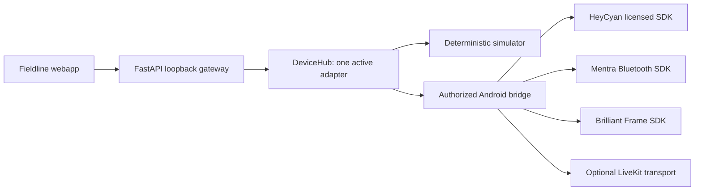

# Device integration runtime

Reviewed 2026-08-10. This is an implementation and evidence map, not a claim of
physical compatibility or clinical readiness.

## Runtime

The browser and all workflows use vendor-neutral commands. One adapter owns the
connection so commands cannot race across competing SDKs. The default adapter
is synthetic. Physical profiles remain unavailable until their local bridge URL
is explicitly configured.

## Evidence table

| Target/framework | Evidence | License/status | Adopted now | Confidence and uncertainty |
|---|---|---|---|---|
| HeyCyan-compatible | [Public SDK repository](https://github.com/ebowwa/HeyCyanSmartGlassesSDK) capability descriptions | Proprietary; written authorization required | Isolated Android interface and external bridge profile | Medium for scan/status/photo/video/audio/media; low for undocumented timing/security; no continuous stream capability asserted |
| MentraOS | [MentraOS](https://github.com/Mentra-Community/MentraOS) and [Bluetooth SDK starter kit](https://github.com/Mentra-Community/Mentra-Bluetooth-SDK-Starter-Kit) | MentraOS reports MIT; verify each SDK/package release | Shared connection-owner pattern and external bridge profile | High for architecture; device features must be negotiated per model |
| Brilliant Frame | [Official Frame SDK documentation](https://docs.brilliant.xyz/frame/frame-sdk/) | SDK/firmware terms must be verified at selected revision | External BLE/Lua bridge profile | High for documented development paths; physical capability verification required |
| LiveKit Android | [Official Android SDK](https://github.com/livekit/client-sdk-android) | Apache-2.0 | Recommended optional real-time sink, not enabled | High for Android WebRTC transport; hospital identity, token, TURN, recording and retention policy remain local work |

No upstream source, firmware, model, dataset or binary is copied by this change.

## Commands and safe behavior

The simulator exercises connection, battery/version queries, photo, preview,
video, audio, stream lifecycle, media list and transfer metadata. Disconnect
always clears preview, stream and active recordings. Unsupported capabilities,
unknown commands and missing media fail closed. Command IDs are idempotent.

Physical adapters must use the bridge contract in
`apps/android-controller/BRIDGE_API.md`. An adapter may advertise only behavior
verified on the exact device model, firmware, mobile OS and SDK version. Browser
camera/microphone capture is intentionally local and separately labeled; it is
never evidence of a glasses feed.

## Framework decisions

- FastAPI/Uvicorn: local API, OpenAPI page and WebSocket event channel.
- Browser MediaDevices/MediaRecorder: local phone/laptop preview, snapshots and
  downloads without uploading media.
- Android vendor bridge: the only place for BLE permissions, licensed SDK calls,
  vendor Wi-Fi transfer and device-specific errors.
- LiveKit: optional future Android transport for tele-mentoring after identity,
  token, encryption, TURN, reconnect, retention and consent review.
- Web Speech API: push-to-talk convenience only; browser support/data routing is
  shown to the user, exact phrases are allowlisted, and state-changing start or
  capture commands require confirmation.

## Physical verification still required

Record the device model, firmware, mobile OS, SDK revision/license, transport,
pairing/security behavior, command acknowledgements, interruption outcomes,
media checksum, thermal/battery performance, privacy indicator and erase path.
Do not modify HeyCyan firmware or implement packet semantics without legal
approval and independent evidence. Brilliant firmware customization is a
separate hardware workstream, not part of this integration baseline.
