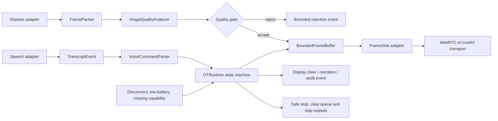

# OT media, voice, and low-latency runtime

This architecture supports observation, documentation, and tele-mentoring
research in an operating-room environment. It intentionally excludes surgical
navigation, instrument control, diagnosis, treatment selection, and patient
identifiers.

## Data flow



## Latency and bottleneck controls

| Stage | Control | Failure response |
|---|---|---|
| Capture | Adapter reports frame dimensions, codec, keyframe status, and capture timestamp | Reject malformed metadata |
| Quality | Luma-only exposure/detail/resolution indicators | Reject frames below the transport quality threshold; do not present the score as clinical quality |
| Queue | Maximum three frames by default | Drop oldest frames to favor freshness; a keyframe-preserving mode rejects non-keyframes when all slots are keyframes |
| Envelope | Bounded IDs, timestamps, dimensions, codec names, sequence numbers, and encoded payload size | Reject malformed, oversized, or stale/out-of-order frames before queueing |
| Transport | `FrameSink.publish()` is injectable | Count sink failures; host adapter owns reconnect and network policy |
| Adaptation | `LatencyController` observes queue depth, RTT, drops, and source score | Prefer the low-latency profile under pressure; no unbounded queue or hidden retry loop |
| Voice | Partial transcripts are not commands; final transcripts must match an exact allowlist and cooldown guard | Reject unknown, low-confidence, stale, or duplicate phrases |

The default queue is intentionally small. A live view that displays old frames
is less useful than a live view that drops stale frames, but dropping frames
must remain visible in metrics so a transport or camera bottleneck is not
silently hidden.

## Voice controls

The current allowlist contains `start streaming`, `stop streaming`, `start
narration`, `stop narration`, and `clear view`, plus `capture photo`/`take
photo` as confirmation-required intents. The parser has no direct device
side-effects. The future Android host must add:

- explicit `RECORD_AUDIO` permission and a visible recording state;
- push-to-talk or a clearly bounded wake-word policy rather than assuming
  continuous recognition is safe or available;
- offline/online selection and model provenance;
- a human confirmation path for capture or any command that changes external
  state;
- deterministic behavior when the model, microphone, network, or display fails.

## OT-safe states

```text
IDLE -> PREFLIGHT -> READY -> STREAMING
  |       |           |         |
  |       |           |         +--> SAFE_STOP on disconnect, failure, or stop
  |       |           +------------> SAFE_STOP on missing capability/battery
  |       +------------------------> SAFE_STOP if consent/indicator is absent
  +--------------------------------> COMPLETED after explicit session end
```

Preflight requires a synthetic session identifier, consent confirmation, a
visible capture indicator, a connected device, at least 30% battery, and camera,
audio, and display capabilities. These are research-runtime gates; they are
not a clinical approval or infection-control checklist.

While READY or STREAMING, `observe_device()` repeats the connection, battery,
and capability checks. A device health loss clears the media queue and moves to
SAFE_STOP.

## Adapter checklist before hardware use

1. Add a device adapter implementing the existing capability contracts.
2. Add a camera adapter that produces bounded `FramePacket` metadata and
   representative luma samples without copying raw captures into logs.
3. Add a reviewed WebRTC/LiveKit sink with reconnect, TURN policy, encryption,
   and hospital network testing.
4. Add an Android speech adapter with permission, offline policy, wake-word or
   push-to-talk behavior, and transcript redaction rules.
5. Measure capture-to-display latency, frame drops, thermal behavior, battery,
   reconnects, and command false activations using synthetic and approved
   non-patient test fixtures.
6. Complete safety, privacy, security, licensing, and human-factors review
   before any clinical or patient-data trial.
