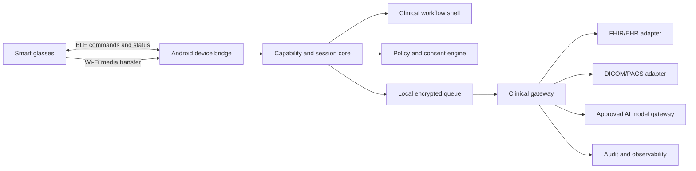

# System architecture

## Device abstraction

Every driver implements the same lifecycle:

`discover → connect → negotiate capabilities → observe state → execute command → emit result → disconnect`

Commands and events are defined in `packages/device-contracts`. Vendor adapters translate them to proprietary SDK calls or documented protocols. No clinical workflow imports a vendor SDK directly.

## Data zones

- **Zone 0 — device:** transient sensor/media data and minimum configuration.
- **Zone 1 — Android edge:** encrypted session state, preview and upload queue.
- **Zone 2 — clinical gateway:** institution policy, identity, consent, routing and audit.
- **Zone 3 — hospital systems:** EHR, PACS, identity and record-of-truth.
- **Zone 4 — AI providers:** only approved, minimized requests through the model gateway.

## Advanced experience layers

1. Device runtime: connection, battery, capture and media transport.
2. Perception runtime: speech, scene sampling and optional on-device inference.
3. Context engine: patient/encounter state, task state and approved knowledge.
4. Interaction composer: glanceable cards, ear audio, confirmations and clear-view action.
5. Agent orchestration: bounded tools, provenance, abstention and human confirmation.
6. Clinical governance: policy packs, feature flags, evidence and audit.

## Recommended evolution

- Phase 1: camera/audio glasses + phone UI; no optical display assumption.
- Phase 2: optional monocular display through a second driver.
- Phase 3: multi-device runtime and app/session scheduling inspired by MentraOS.
- Phase 4: regulated spatial tracking/navigation as a separate product line.

