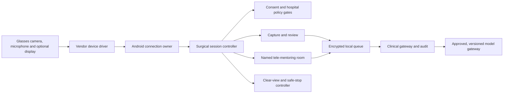

# Surgeon-facing system design

## Runtime path

## Component boundaries

- `apps/android-controller`: owns the physical connection and Android permissions.
- `packages/device-contracts`: vendor-neutral device commands and events.
- `packages/surgical-workflows`: preflight, session and fail-safe state contract.
- `services/surgical-session-orchestrator`: future API boundary for policy and audit.
- `services/clinical-gateway`: hospital identity, consent, retention and integrations.
- `tools/surgical_session_simulator.py`: deterministic synthetic end-to-end scenario.

## Rules the implementation must preserve

1. The glasses driver never decides clinical workflow state.
2. The session cannot become ready until every mandatory preflight gate is recorded.
3. Capture and streaming state are always visible and have a local stop control.
4. Disconnect, missing capability or policy expiry stops capture/stream and suppresses overlays.
5. Clear-view works without network or AI and suppresses optional display/audio content.
6. AI outputs are drafts or advisory research artifacts with source, time and model version.
7. The audit log records commands, results and policy decisions but excludes media and PHI.

## Future AI boundary

AI inference should be a replaceable service behind an approved model gateway. The
session controller sends only the minimum permitted input and receives a structured
result containing model identity, version, confidence/abstention, source provenance,
latency and expiry. The interaction layer may reject or withhold any result. No model
may directly control capture, devices, records or clinical actions.

